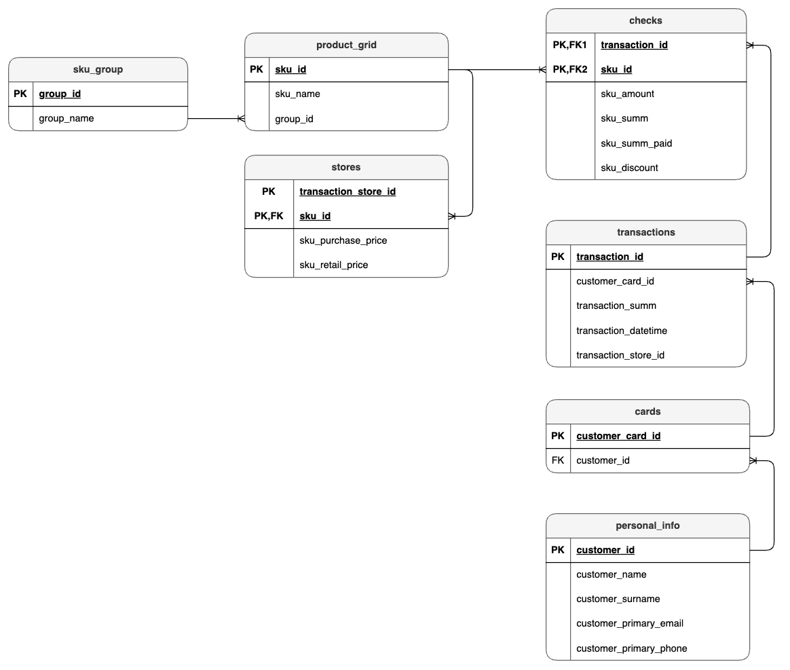

# HSE / Final Python Project
## Contents

1. [Introduction](#introduction)
2. [Chapter I](#chapter-i) \
   2.1. [Logical view of database model](#logical-view-of-database-model)  
   2.2. [Description of data](#description-of-data)  

## Introduction

In this project, need to upload the retail network's analytical data to **PostgreSQL**, set up replication in **MySQL** using **Apache Airflow**, and create several analytical **data marts**.

## Chapter I
## Logical view of database model

`

## Description of data

### Entity Personal information (`personal_info`)

|       **Field**       | **System field name**  |                                        **Format / possible values**                                        | **Description** |
| :-------------------: | :--------------------: | :--------------------------------------------------------------------------------------------------------: | :-------------: |
|      customer id      |      customer_id       |                                                    ---                                                     |       ---       |
|         name          |     customer_name      | cyrillic or latin, the first letter is capitalized, the rest are lower case, dashes and spaces are allowed |       ---       |
|        surname        |    customer_surname    | cyrillic or latin, the first letter is capitalized, the rest are lower case, dashes and spaces are allowed |       ---       |
|    customer e-mail    | customer_primary_email |                                               e-mail format                                                |       ---       |
| customer phone number | customer_primary_phone |                                         +7 and 10 arabic numerals                                          |       ---       |

### Entity Cards (`cards`)

|  **Field**  | **System field name** | **Format / possible values** |          **Description**           |
| :---------: | :-------------------: | :--------------------------: | :--------------------------------: |
|   card id   |   customer_card_id    |             ---              |                ---                 |
| customer id |      customer_id      |             ---              | one customer can own several cards |

### Entity Transactions (`transactions`)

|    **Field**     | **System field name** | **Format / possible values** |                          **Description**                           |
| :--------------: | :-------------------: | :--------------------------: | :----------------------------------------------------------------: |
|  transaction id  |    transaction_id     |             ---              |                            unique value                            |
|     card id      |   customer_card_id    |             ---              |                                ---                                 |
| transaction sum  |   transaction_summ    |        arabic numeral        | transaction sum in rubles(full purchase price excluding discounts) |
| transaction date | transaction_datetime  |     dd.mm.yyyy hh:mm:ss      |            date and time when the transaction was made             |
|      store       | transaction_store_id  |           store id           |              the store where the transaction was made              |

### Entity Checks (`checks`)

|                    **Field**                     | **System field name** | **Format / possible values** |                                                **Description**                                                |
| :----------------------------------------------: | :-------------------: | :--------------------------: | :-----------------------------------------------------------------------------------------------------------: |
|                  transaction id                  |    transaction_id     |             ---              |                           transaction id is specified for all products in the check                           |
|               product in the check               |        sku_id         |             ---              |                                                      ---                                                      |
|          number of pieces or kilograms           |      sku_amount       |        arabic numeral        |                                     the quantity of the purchased product                                     |
| total amount for which the product was purchased |       sku_summ        |        arabic numeral        | the purchase amount of the actual volume of this product in rubles (full price without discounts and bonuses) |
|          the paid price of the product           |     sku_summ_paid     |        arabic numeral        |                      the amount actually paid for the product not including the discount                      |
|                 discount granted                 |     sku_discount      |        arabic numeral        |                          the size of the discount granted for the product in rubles                           |

### Entity Product grid (`product_grid`)

|  **Field**   | **System field name** |              **Format / possible values**              |                                                                                                        **Description**                                                                                                        |
| :----------: | :-------------------: | :----------------------------------------------------: | :---------------------------------------------------------------------------------------------------------------------------------------------------------------------------------------------------------------------------: |
|  product id  |        sku_id         |                          ---                           |                                                                                                              ---                                                                                                              |
| product name |       sku_name        | cyrillic or latin, arabic numerals, special characters |                                                                                                              ---                                                                                                              |
|  sku group   |       group_id        |                          ---                           | the id of the group of related products to which the product belongs (for example, same type of yogurt of the same manufacturer and volume, but different flavors). one identifier is specified for all products in the group |

### Entity Stores (`stores`)

|       **Field**        | **System field name** | **Format / possible values** |                         **Description**                          |
| :--------------------: | :-------------------: | :--------------------------: | :--------------------------------------------------------------: |
|         store          | transaction_store_id  |             ---              |                               ---                                |
|       product id       |        sku_id         |             ---              |                               ---                                |
| product purchase price |  sku_purchase_price   |        arabic numeral        |           purchasing price of products for this store            |
|  product retail price  |   sku_retail_price    |        arabic numeral        | the sale price of the product excluding discounts for this store |

### Entity SKU group (`sku_group`)

| **Field**  | **System field name** |              **Format / possible values**              | **Description** |     |
| :--------: | :-------------------: | :----------------------------------------------------: | :-------------: | --- |
| sku group  |       group_id        |                          ---                           |       ---       |     |
| group name |      group_name       | cyrillic or latin, arabic numerals, special characters |       ---       |     |
